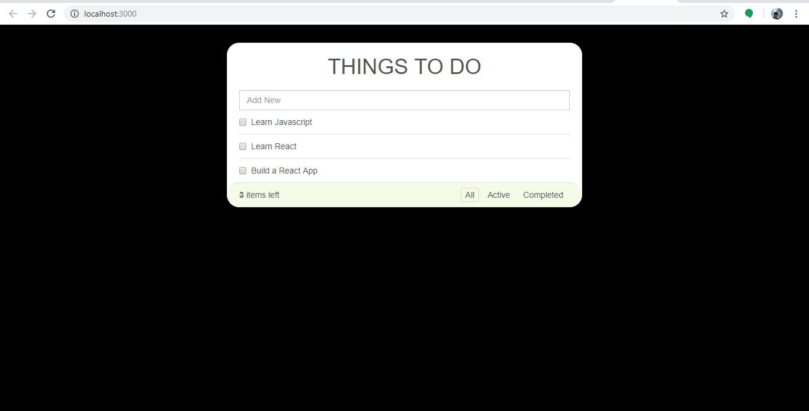

# todo-with-react

# How to start the server
+ go to root folder (*here* **todo-with-react** )
+ start the server 
    ```
    npm start
    ```
+ terminal say 
    ```
    You can now view todo-with-react in the browser.

    Local:            http://localhost:3000/
    On Your Network:  http://192.168.255.1:3000/
    ```
+ stop the server
    ```
    ctrl+C
    ```
## Screenshots
